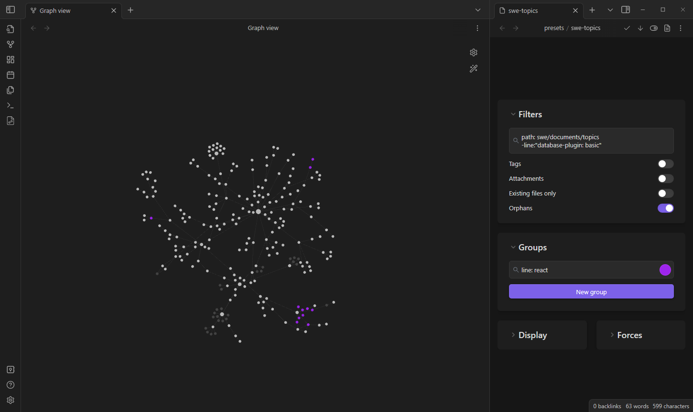

## Obsidian Graph Presets Plugin

This is a plugin for Obsidian (https://obsidian.md).

Markdown-based graph controls.

## Installation

This plugin is currently in beta and cannot be installed through the community plugin store.

### Installing the plugin using BRAT
[Quick Guide for using BRA](https://github.com/TfTHacker/obsidian42-brat#Quick-Guide-for-using-BRAT)

### Manually installing the plugin

- Download `main.js`, `styles.css`  and `manifest.json` from [obsidian-graph-presets/releases](https://github.com/ycnmhd/obsidian-graph-presets/releases) to your vault `vault/.obsidian/plugins/obsidian-graph-presets/`.
